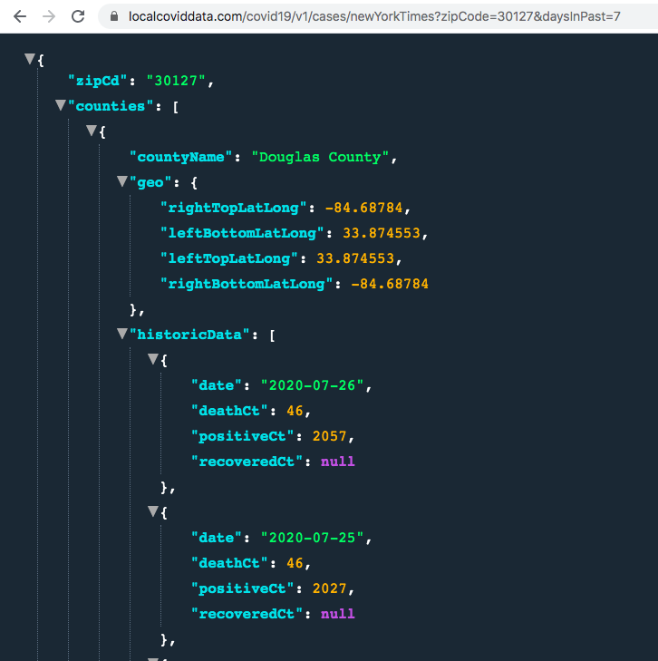
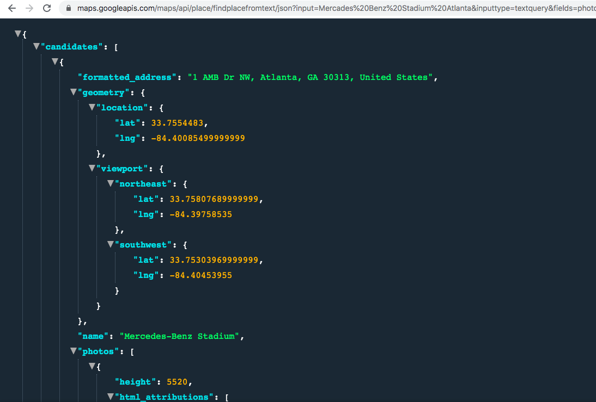
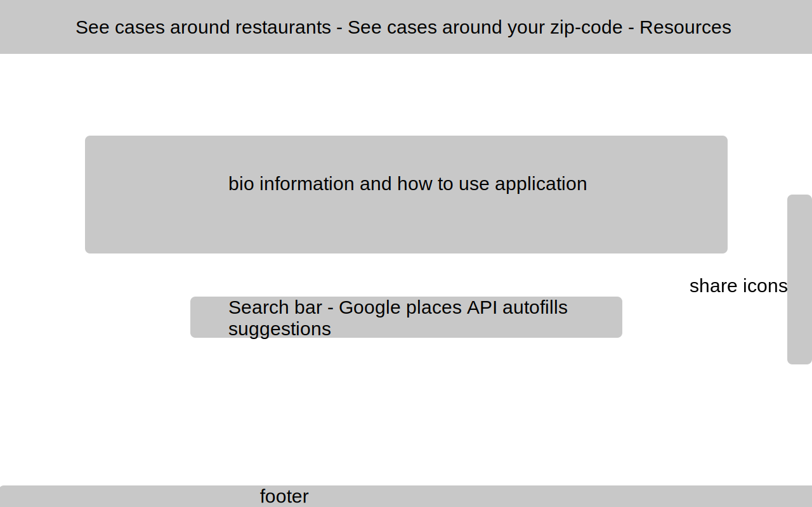
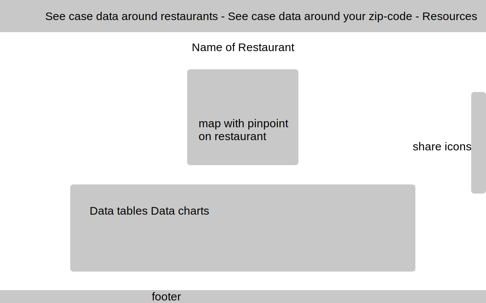
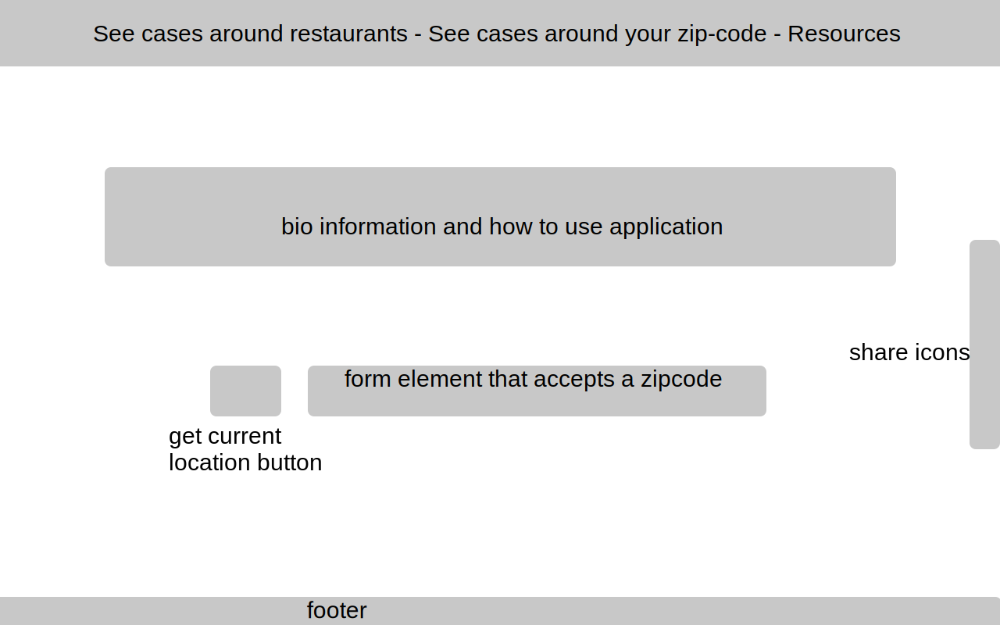

# How hot is your spot? 
### See how Covid-19 is effecting your favorite places to go.
### These days, if you want to go out to eat or to grab a drink, it's hard to tell how effected your local areas are by Covid-19 and where they stand in comparison to the rest of the state and country.

## Summary
- This is an application that lets you enter your favorite restaurant and see the number of Covid-19 cases for that zip code in comparison to neighboring zip codes, state, and national averages. This app allows the user to see how effected their favorite areas to go are.

## API's used
1. COVID-19 Data Tracking API
- Link to API: https://anypoint.mulesoft.com/exchange/68ef9520-24e9-4cf2-b2f5-620025690913/covid19-data-tracking-api/minor/1.0/pages/home/

2. Google place search
- Link to API: https://developers.google.com/places/web-service/search

## Challenges 
- One challenge I see with this project will be storing the entered restaurant information and passing it's zip code into the API call. While that's going on, I will also have to call for comparason data.

## Wireframe
Landing Page

Results Page

Local Search Landing Page

## Development Schedule:
### Tuesday:
- FIgure out the how to take user input into a Google Places API request to then store that data into a state. 
- - Utilize Google's autocomplete feature and locationbias feature to better recommend what the user is looking for.
### Wednesday:
- Work with the Covid-19 API to pull all data from a location based on the stored data from the Google API call.
- Build out Landing page
### Thursday: 
- Figure out how to display data in tables and charts
- Take stored search data and results and pull additional data from Covid-19 API to display compared statistics.
### Friday:
- Use Recharts library to graph the comparison between searched data to local, state, and national data. (partially a stretcch goal)
### Saturday: 
- Build out resources page that will have links to official Covid-19 information and testing websites.
- Build out Navbar
- Build out social media sharing 
### Sunday: 
- CSS everything